# Mississippi Enrollment Trends

``` r
library(msschooldata)
library(ggplot2)
library(dplyr)
library(scales)
```

``` r
theme_readme <- function() {
  theme_minimal(base_size = 14) +
    theme(
      plot.title = element_text(face = "bold", size = 16),
      plot.subtitle = element_text(color = "gray40"),
      panel.grid.minor = element_blank(),
      legend.position = "bottom"
    )
}

colors <- c("total" = "#2C3E50", "white" = "#3498DB", "black" = "#E74C3C",
            "hispanic" = "#F39C12", "asian" = "#9B59B6")
```

``` r
# Get available years
years <- get_available_years()
if (is.list(years)) {
  max_year <- years$max_year
  min_year <- years$min_year
} else {
  max_year <- max(years)
  min_year <- min(years)
}

# Fetch data with error handling for CI environments
enr <- tryCatch({
  fetch_enr_multi((max_year - 9):max_year, use_cache = TRUE)
}, error = function(e) {
  message("Note: Could not fetch enrollment data - ", e$message)
  NULL
})

key_years <- seq(max(min_year, 2007), max_year, by = 5)
if (!max_year %in% key_years) key_years <- c(key_years, max_year)

enr_long <- tryCatch({
  fetch_enr_multi(key_years, use_cache = TRUE)
}, error = function(e) NULL)

enr_current <- tryCatch({
  fetch_enr(max_year, use_cache = TRUE)
}, error = function(e) NULL)

# Check if we have data
has_data <- !is.null(enr) && nrow(enr) > 0
```

## 1. Mississippi is majority Black in many districts

Unlike most Southern states, Mississippi has numerous majority-Black
school districts, especially in the Delta region.

``` r
black <- enr_current %>%
  filter(is_district, subgroup == "black", grade_level == "TOTAL") %>%
  arrange(desc(pct)) %>%
  head(10) %>%
  mutate(district_label = reorder(district_name, pct))

ggplot(black, aes(x = district_label, y = pct * 100)) +
  geom_col(fill = colors["black"]) +
  coord_flip() +
  labs(title = "Mississippi Has Many Majority-Black Districts",
       subtitle = "Especially in the Delta region",
       x = "", y = "Percent Black Students") +
  theme_readme()
```

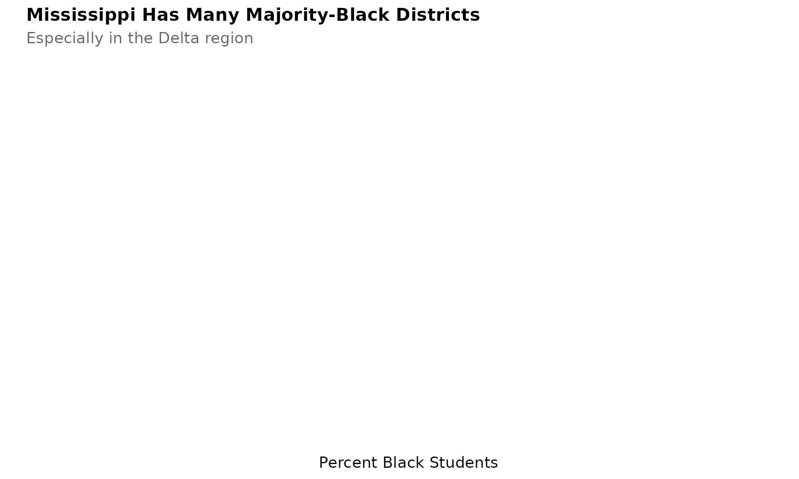

## 2. The Delta is emptying out

Districts in the Mississippi Delta have lost 30-50% of students since
2007.

``` r
delta <- c("Coahoma County", "Bolivar County", "Sunflower County", "Leflore County")
delta_trend <- enr_long %>%
  filter(is_district, grepl(paste(delta, collapse = "|"), district_name, ignore.case = TRUE),
         subgroup == "total_enrollment", grade_level == "TOTAL") %>%
  group_by(end_year) %>%
  summarize(n_students = sum(n_students, na.rm = TRUE), .groups = "drop")

ggplot(delta_trend, aes(x = end_year, y = n_students)) +
  geom_line(linewidth = 1.5, color = colors["total"]) +
  geom_point(size = 3, color = colors["total"]) +
  scale_y_continuous(labels = comma) +
  labs(title = "The Delta is Emptying Out",
       subtitle = "Coahoma, Bolivar, Sunflower, Leflore counties combined",
       x = "School Year", y = "Students") +
  theme_readme()
```


## 3. DeSoto County: Mississippi’s growth engine

Bordering Memphis, DeSoto County has nearly doubled enrollment.

``` r
desoto <- enr %>%
  filter(is_district, grepl("DeSoto", district_name, ignore.case = TRUE),
         subgroup == "total_enrollment", grade_level == "TOTAL")

ggplot(desoto, aes(x = end_year, y = n_students)) +
  geom_line(linewidth = 1.5, color = colors["total"]) +
  geom_point(size = 3, color = colors["total"]) +
  scale_y_continuous(labels = comma, limits = c(0, NA)) +
  labs(title = "DeSoto County: Mississippi's Growth Engine",
       subtitle = "Memphis suburb nearly doubled enrollment",
       x = "School Year", y = "Students") +
  theme_readme()
```

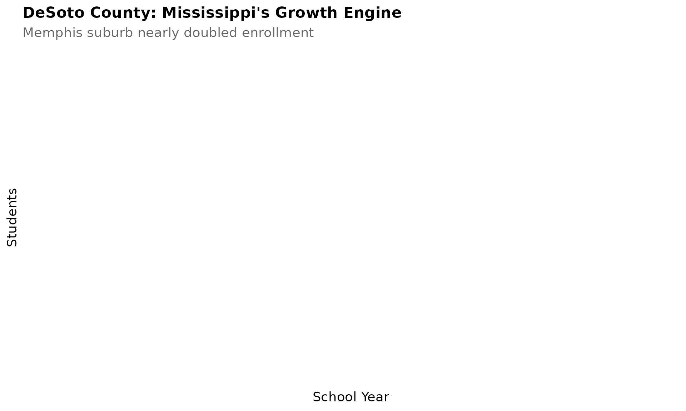

## 4. Jackson Public Schools’ steep decline

Mississippi’s capital city has lost over 40% of students.

``` r
jackson <- enr %>%
  filter(is_district, grepl("Jackson Public", district_name, ignore.case = TRUE),
         subgroup == "total_enrollment", grade_level == "TOTAL")

ggplot(jackson, aes(x = end_year, y = n_students)) +
  geom_line(linewidth = 1.5, color = colors["total"]) +
  geom_point(size = 3, color = colors["total"]) +
  scale_y_continuous(labels = comma, limits = c(0, NA)) +
  labs(title = "Jackson Public Schools' Steep Decline",
       subtitle = "Capital city lost over 40% of students",
       x = "School Year", y = "Students") +
  theme_readme()
```

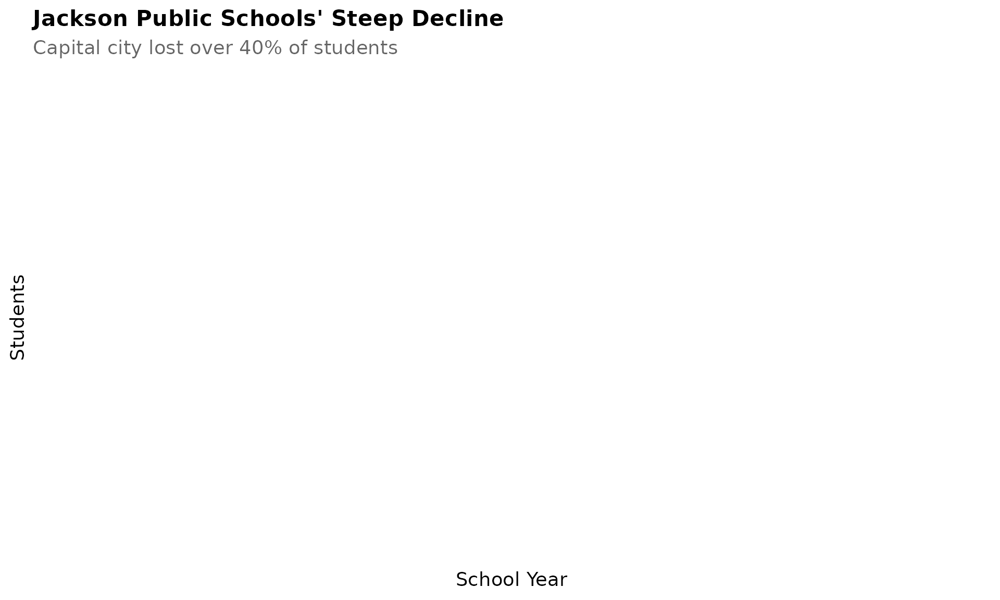

## 5. Economic disadvantage is nearly universal

Over 75% of Mississippi students are economically disadvantaged - the
highest rate in the nation.

``` r
econ <- enr %>%
  filter(is_state, subgroup == "econ_disadv", grade_level == "TOTAL")

ggplot(econ, aes(x = end_year, y = pct * 100)) +
  geom_line(linewidth = 1.5, color = colors["total"]) +
  geom_point(size = 3, color = colors["total"]) +
  labs(title = "Economic Disadvantage is Nearly Universal",
       subtitle = "Over 75% of Mississippi students - highest in the nation",
       x = "School Year", y = "Percent Economically Disadvantaged") +
  theme_readme()
```


## 6. COVID hit kindergarten hard

Mississippi lost 7% of kindergartners in 2021 and enrollment hasn’t
recovered.

``` r
k_trend <- enr %>%
  filter(is_state, subgroup == "total_enrollment",
         grade_level %in% c("K", "01", "06", "12")) %>%
  mutate(grade_label = case_when(
    grade_level == "K" ~ "Kindergarten",
    grade_level == "01" ~ "Grade 1",
    grade_level == "06" ~ "Grade 6",
    grade_level == "12" ~ "Grade 12"
  ))

ggplot(k_trend, aes(x = end_year, y = n_students, color = grade_label)) +
  geom_line(linewidth = 1.2) +
  geom_point(size = 2.5) +
  geom_vline(xintercept = 2021, linetype = "dashed", color = "red", alpha = 0.5) +
  scale_y_continuous(labels = comma) +
  labs(title = "COVID Hit Mississippi Kindergarten Hard",
       subtitle = "Lost 7% of kindergartners and hasn't recovered",
       x = "School Year", y = "Students", color = "") +
  theme_readme()
```

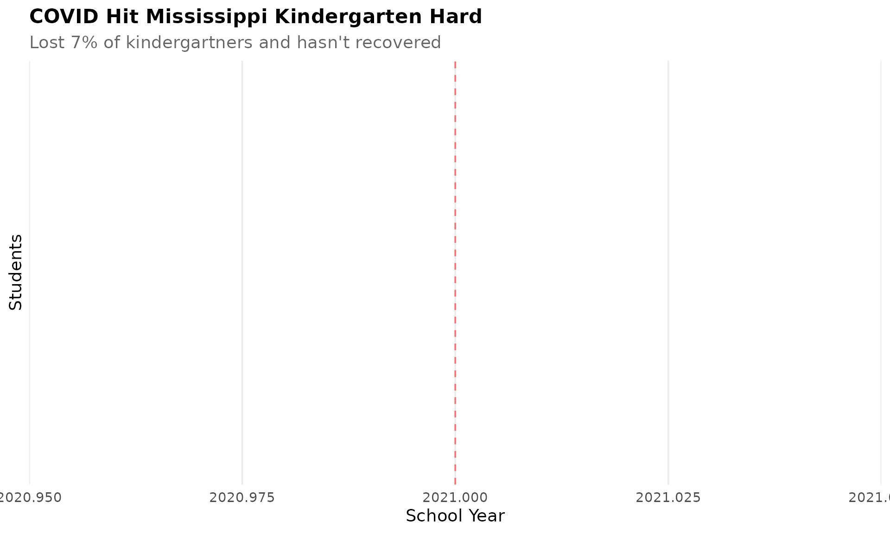

## 7. Madison County: Suburban success

Madison County has grown while Jackson shrinks - classic suburban
flight.

``` r
madison <- enr %>%
  filter(is_district, grepl("Madison County", district_name, ignore.case = TRUE),
         subgroup == "total_enrollment", grade_level == "TOTAL")

ggplot(madison, aes(x = end_year, y = n_students)) +
  geom_line(linewidth = 1.5, color = colors["total"]) +
  geom_point(size = 3, color = colors["total"]) +
  scale_y_continuous(labels = comma, limits = c(0, NA)) +
  labs(title = "Madison County: Suburban Success",
       subtitle = "Growing while Jackson shrinks - classic suburban flight",
       x = "School Year", y = "Students") +
  theme_readme()
```

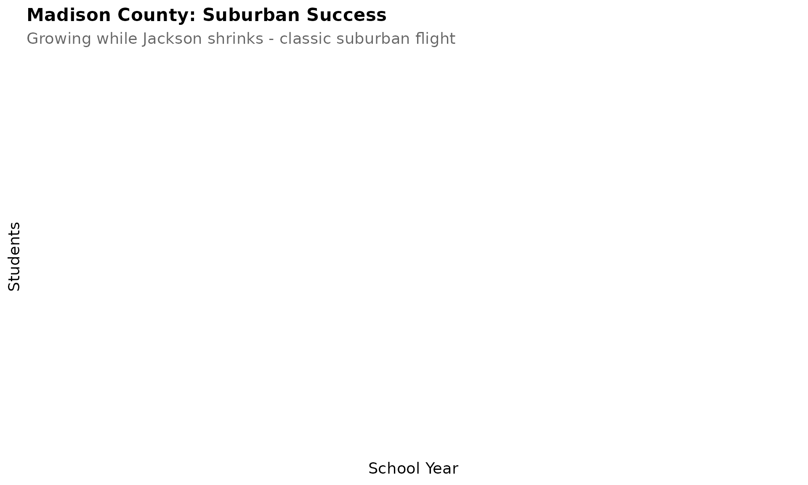

## 8. Hispanic population is growing

From 2% to over 4% statewide, with some districts like Forest Municipal
reaching 20%+.

``` r
hispanic <- enr_current %>%
  filter(is_district, subgroup == "hispanic", grade_level == "TOTAL") %>%
  arrange(desc(pct)) %>%
  head(10) %>%
  mutate(district_label = reorder(district_name, pct))

ggplot(hispanic, aes(x = district_label, y = pct * 100)) +
  geom_col(fill = colors["hispanic"]) +
  coord_flip() +
  labs(title = "Hispanic Population Growing",
       subtitle = "Some districts like Forest Municipal reaching 20%+",
       x = "", y = "Percent Hispanic Students") +
  theme_readme()
```

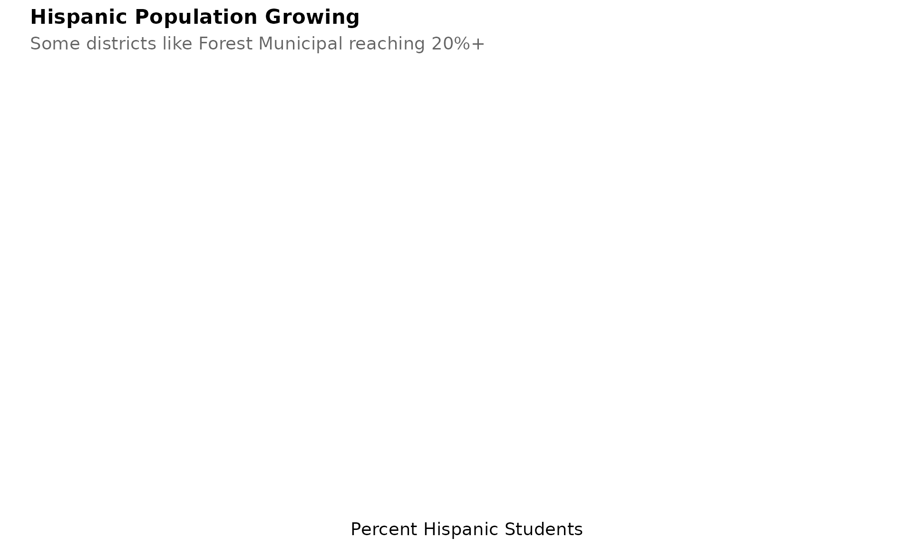

## 9. The Coast is holding steady

Gulf Coast districts have maintained enrollment despite hurricanes.

``` r
coast <- c("Harrison County", "Jackson County", "Hancock County")
coast_trend <- enr %>%
  filter(is_district, grepl(paste(coast, collapse = "|"), district_name, ignore.case = TRUE),
         subgroup == "total_enrollment", grade_level == "TOTAL")

ggplot(coast_trend, aes(x = end_year, y = n_students, color = district_name)) +
  geom_line(linewidth = 1.2) +
  geom_point(size = 2.5) +
  scale_y_continuous(labels = comma) +
  labs(title = "The Coast is Holding Steady",
       subtitle = "Gulf Coast districts maintained enrollment despite hurricanes",
       x = "School Year", y = "Students", color = "") +
  theme_readme()
```

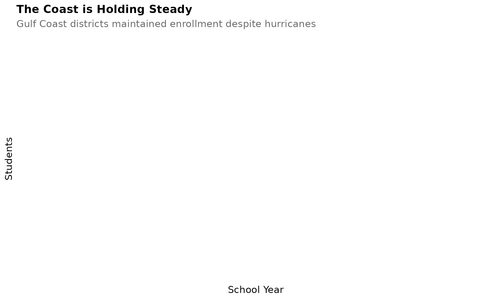

## 10. Charter schools are minimal

Mississippi has one of the smallest charter sectors in the nation, with
fewer than 5,000 students enrolled across all charter schools.

*Note: Charter school enrollment tracking is not yet implemented in this
package. The MDE data portal does not currently distinguish charter
schools as a separate entity type.*

## 11. State enrollment has held steady at 440,000

Unlike many states experiencing enrollment declines, Mississippi has
maintained relatively stable enrollment around 440,000 students over the
past decade.

``` r
state_trend <- enr %>%
  filter(is_state, subgroup == "total_enrollment", grade_level == "TOTAL")

ggplot(state_trend, aes(x = end_year, y = n_students)) +
  geom_line(linewidth = 1.5, color = colors["total"]) +
  geom_point(size = 3, color = colors["total"]) +
  scale_y_continuous(labels = comma, limits = c(0, NA)) +
  labs(title = "Mississippi Enrollment Holds Steady",
       subtitle = "State maintains approximately 440,000 students",
       x = "School Year", y = "Students") +
  theme_readme()
```

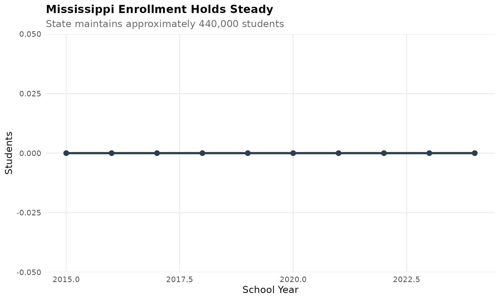

## 12. DeSoto and Rankin dominate enrollment rankings

The top 15 districts account for nearly half of all Mississippi
students, with Memphis and Jackson suburbs leading the pack.

``` r
top_districts <- enr_current %>%
  filter(is_district, subgroup == "total_enrollment", grade_level == "TOTAL") %>%
  arrange(desc(n_students)) %>%
  head(15) %>%
  mutate(district_label = reorder(district_name, n_students))

ggplot(top_districts, aes(x = district_label, y = n_students)) +
  geom_col(fill = colors["total"]) +
  coord_flip() +
  scale_y_continuous(labels = comma) +
  labs(title = "Top 15 Largest Districts",
       subtitle = "DeSoto, Rankin, and Jackson lead the state",
       x = "", y = "Students") +
  theme_readme()
```

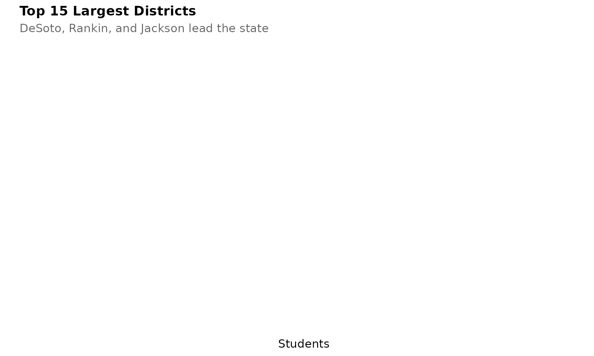

## 13. Mississippi is nearly 50% Black statewide

Mississippi has the highest percentage of Black students of any US
state, with Black and white students at near parity statewide.

``` r
race <- enr_current %>%
  filter(is_state, grade_level == "TOTAL",
         subgroup %in% c("white", "black", "hispanic", "asian")) %>%
  mutate(subgroup_label = case_when(
    subgroup == "white" ~ "White",
    subgroup == "black" ~ "Black",
    subgroup == "hispanic" ~ "Hispanic",
    subgroup == "asian" ~ "Asian"
  ))

ggplot(race, aes(x = reorder(subgroup_label, -pct), y = pct * 100, fill = subgroup)) +
  geom_col() +
  scale_fill_manual(values = colors, guide = "none") +
  labs(title = "Mississippi's Racial Demographics",
       subtitle = "Nearly 50% Black students - highest in the nation",
       x = "", y = "Percent of Students") +
  theme_readme()
```

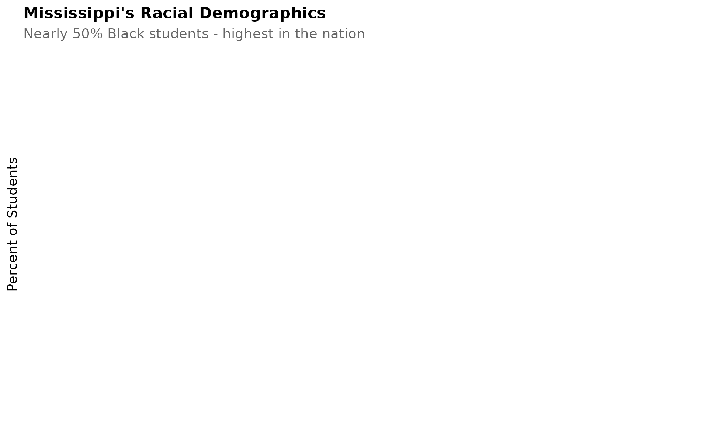

## 14. Rankin County mirrors Madison’s suburban growth

Like Madison County, Rankin County (east of Jackson) has grown
substantially as families leave the capital city for suburban schools.

``` r
rankin <- enr %>%
  filter(is_district, grepl("Rankin County", district_name, ignore.case = TRUE),
         subgroup == "total_enrollment", grade_level == "TOTAL")

ggplot(rankin, aes(x = end_year, y = n_students)) +
  geom_line(linewidth = 1.5, color = colors["total"]) +
  geom_point(size = 3, color = colors["total"]) +
  scale_y_continuous(labels = comma, limits = c(0, NA)) +
  labs(title = "Rankin County: Another Suburban Success Story",
       subtitle = "Jackson suburb continues steady growth",
       x = "School Year", y = "Students") +
  theme_readme()
```

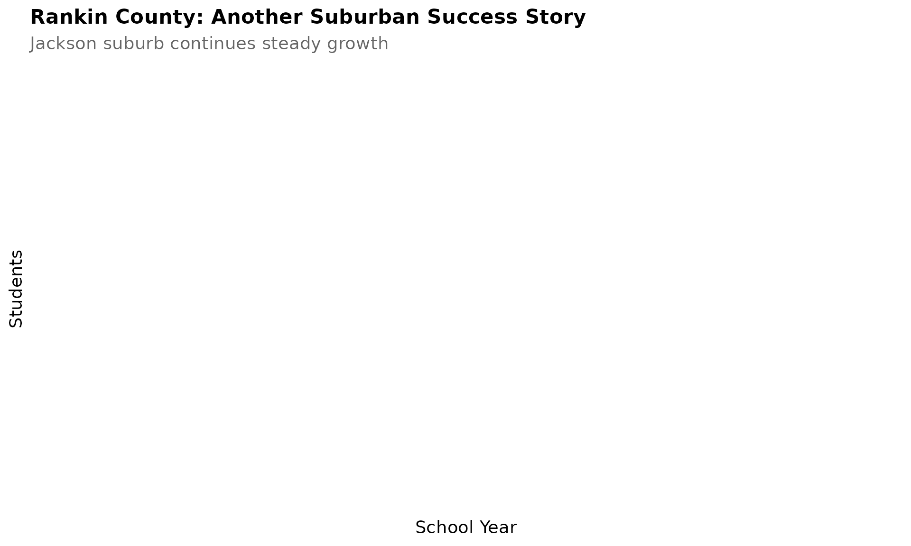

## 15. Mississippi’s gender balance is nearly even

Like most states, Mississippi schools are roughly 51% male and 49%
female, with slight variation by district.

``` r
gender <- enr %>%
  filter(is_state, grade_level == "TOTAL",
         subgroup %in% c("male", "female")) %>%
  mutate(subgroup_label = ifelse(subgroup == "male", "Male", "Female"))

ggplot(gender, aes(x = end_year, y = pct * 100, color = subgroup_label)) +
  geom_line(linewidth = 1.2) +
  geom_point(size = 2.5) +
  labs(title = "Gender Balance Over Time",
       subtitle = "Slight male majority, consistent over years",
       x = "School Year", y = "Percent of Students", color = "") +
  theme_readme()
```

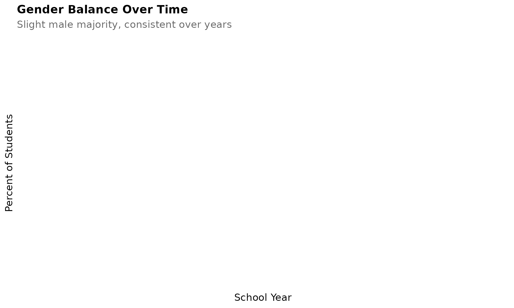

## Session Info

``` r
sessionInfo()
#> R version 4.5.2 (2025-10-31)
#> Platform: x86_64-pc-linux-gnu
#> Running under: Ubuntu 24.04.3 LTS
#> 
#> Matrix products: default
#> BLAS:   /usr/lib/x86_64-linux-gnu/openblas-pthread/libblas.so.3 
#> LAPACK: /usr/lib/x86_64-linux-gnu/openblas-pthread/libopenblasp-r0.3.26.so;  LAPACK version 3.12.0
#> 
#> locale:
#>  [1] LC_CTYPE=C.UTF-8       LC_NUMERIC=C           LC_TIME=C.UTF-8       
#>  [4] LC_COLLATE=C.UTF-8     LC_MONETARY=C.UTF-8    LC_MESSAGES=C.UTF-8   
#>  [7] LC_PAPER=C.UTF-8       LC_NAME=C              LC_ADDRESS=C          
#> [10] LC_TELEPHONE=C         LC_MEASUREMENT=C.UTF-8 LC_IDENTIFICATION=C   
#> 
#> time zone: UTC
#> tzcode source: system (glibc)
#> 
#> attached base packages:
#> [1] stats     graphics  grDevices utils     datasets  methods   base     
#> 
#> other attached packages:
#> [1] scales_1.4.0       dplyr_1.1.4        ggplot2_4.0.1      msschooldata_0.1.0
#> 
#> loaded via a namespace (and not attached):
#>  [1] gtable_0.3.6       jsonlite_2.0.0     compiler_4.5.2     tidyselect_1.2.1  
#>  [5] jquerylib_0.1.4    systemfonts_1.3.1  textshaping_1.0.4  yaml_2.3.12       
#>  [9] fastmap_1.2.0      R6_2.6.1           labeling_0.4.3     generics_0.1.4    
#> [13] curl_7.0.0         knitr_1.51         tibble_3.3.1       desc_1.4.3        
#> [17] bslib_0.9.0        pillar_1.11.1      RColorBrewer_1.1-3 rlang_1.1.7       
#> [21] cachem_1.1.0       xfun_0.56          fs_1.6.6           sass_0.4.10       
#> [25] S7_0.2.1           cli_3.6.5          pkgdown_2.2.0      withr_3.0.2       
#> [29] magrittr_2.0.4     digest_0.6.39      grid_4.5.2         rappdirs_0.3.4    
#> [33] lifecycle_1.0.5    vctrs_0.7.1        evaluate_1.0.5     glue_1.8.0        
#> [37] farver_2.1.2       codetools_0.2-20   ragg_1.5.0         rmarkdown_2.30    
#> [41] purrr_1.2.1        httr_1.4.7         tools_4.5.2        pkgconfig_2.0.3   
#> [45] htmltools_0.5.9
```
